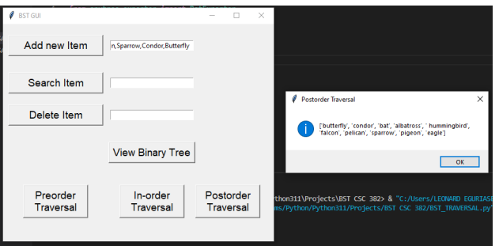
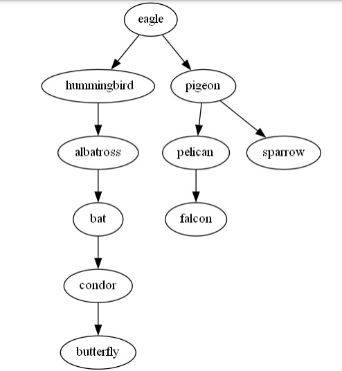

# Binary Search App
Study platform to share ideas

Python program that performs the following operations:
- Read in or Add item into the Binary tree data set.
- Search for an item in the binary tree or display ‘NUL” if not found.
- Delete or remove an item from the Binary tree
- Display the binary tree diagram.
- perform any of the traversal algorithm (Preorder, Postorder, and inorder).

## Image
<!--Images-->

